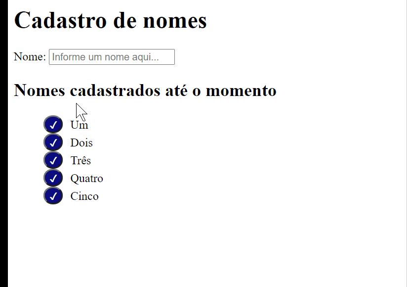
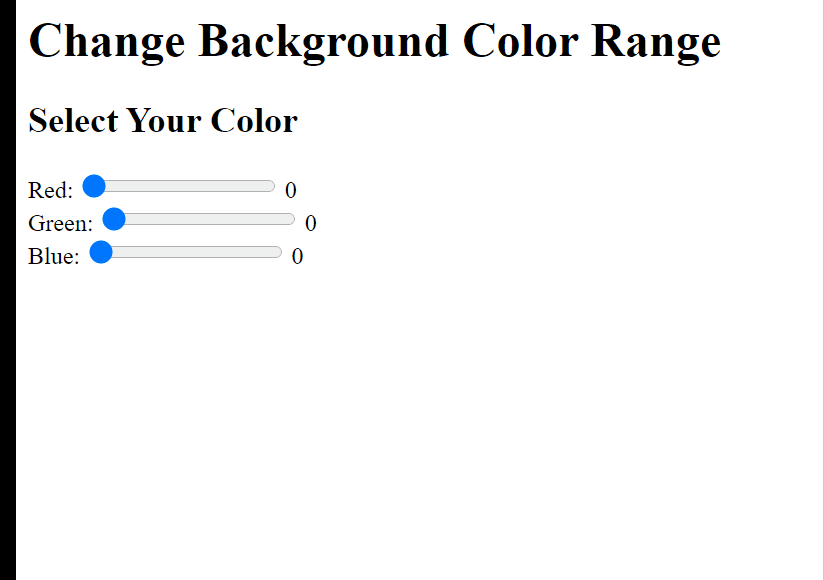

<h2 align="center">Bootcamp FullStack Developer maio/2020 © </h2>

 
     

     
     

## Desenvolvedores:
[  Emerson Pessoa ](https://github.com/emersonpessoa01) | [  Git Ironman ]() | [  Octocat Nerd ]() | [  Mestre Yoda ]() |
| :---: | :---: | :---: | :---: |
     

<h2> Preview: </h2>

[  CRUD ](https://github.com/emersonpessoa01/igti-bootcamp-fullstack/tree/master/modulo01/CRUD) | [  COLOR SELECTOR ](https://github.com/emersonpessoa01/igti-bootcamp-fullstack/tree/master/modulo01/color-selector) |
| :---: | :---: |

[  RANGER SLIDERS ](https://github.com/emersonpessoa01/igti-bootcamp-fullstack/tree/master/modulo01/rangerSliders) | [ JS PERFORMÁTICO]() |
| :---: | :---: |

[   RÁDIO PODCAST ](https://github.com/emersonpessoa01) |
| :---:|

     <b>
     Conteúdo Programático: :octocat:
     </b>

<a href="https://github.com/emersonpessoa01/igti-bootcamp-fullstack">

     

</a>

---
 

---

#### **Módulo 1** :books: 

:heavy_check_mark: Fundamentos Introdução, instalação e configuração do Visual Studio Code (VSCode). 
:heavy_check_mark: Instalação do Node.js. 
:heavy_check_mark: Instalação da biblioteca live-server. 
:heavy_check_mark: Noções de HTML e CSS. 
:heavy_check_mark: Introdução ao JavaScript. 
:heavy_check_mark: Integração do JavaScript com o HTML e CSS. 
:heavy_check_mark: JavaScript básico, console, comentários, tipos primitivos, variáveis, APIs nativas de servidor e web,
funções, estruturas de decisão, estruturas de repetição e manipulação de eventos. 
:heavy_check_mark: Desenvolvimento de APIs

#### **Módulo 2** :books:

:heavy_check_mark: Introdução ao desenvolvimento backend. 
:heavy_check_mark: Backend x frontend. 
:heavy_check_mark: Introdução ao desenvolvimento de APIs. 
:heavy_check_mark: Introdução ao desenvolvimento com Node.js. 
:heavy_check_mark: Introdução ao Express. 
:heavy_check_mark: Criação de requisições HTTP, rotas e middlewares com Express. 
:heavy_check_mark: Introdução à ferramenta Insomnia. 
:heavy_check_mark: Construção de APIs HTTP, utilizando as principais operações: GET, POST, PUT, e DELETE. 
:heavy_check_mark: Desenvolvimento das operações CRUD. 
:heavy_check_mark: Persistência de Dados em Arqu3vos. 

---

#### **Módulo 3** :books:

:heavy_check_mark: FrontEnd com React Instalação e configuração do React. 
:heavy_check_mark: Criação de projetos com o create-react-app. 
:heavy_check_mark: Introdução ao React 
:heavy_check_mark: JSX, Componentes de Funções 
:heavy_check_mark: Componentes de Classe 
:heavy_check_mark: State, Props, Binding e Interpolação. 
:heavy_check_mark: Comunicação entre componentes. 
:heavy_check_mark: Ciclo de vida de componentes de classe. 
:heavy_check_mark: Introdução às requisições HTTP com React. 
:heavy_check_mark: Roteamento com react-router. 
:heavy_check_mark: Introdução ao Ionic React. 
:heavy_check_mark: Criação de um pequeno projeto. 
:heavy_check_mark: passo-a-passo com React. 

#### **Módulo 4** :books:

:heavy_check_mark: Persistência de dados, versionamento de código e implantação e Introdução ao MongoDB. 
:heavy_check_mark: Utilização do serviço mLab. Integrando a API ao MongoDB no mLab. 
:heavy_check_mark: Introdução ao Git. 
:heavy_check_mark: Instalação do git. 
:heavy_check_mark: Principais comandos do Git. 
:heavy_check_mark: Como publicar aplicações no Github. 

---

#### **Módulo 5** :books:

:heavy_check_mark: Introdução ao Heroku. 
:heavy_check_mark: Instalação do Heroku CLI. 
:heavy_check_mark: Como implantar aplicações no Heroku. 
:heavy_check_mark: Fechamento: Entrega do Desafio Final. :trophy:

---

